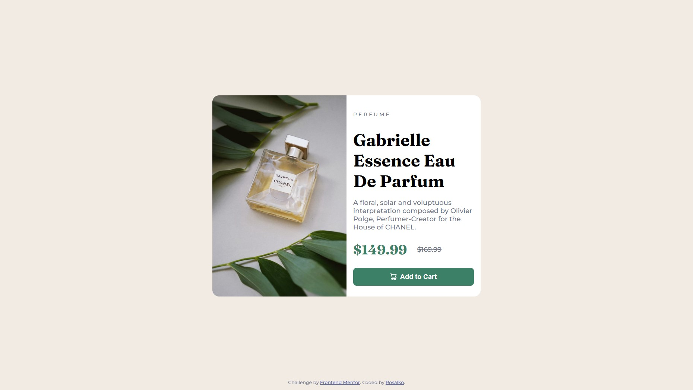

# Frontend Mentor - Product preview card component solution

This is a solution to the [Product preview card component challenge on Frontend Mentor](https://www.frontendmentor.io/challenges/product-preview-card-component-GO7UmttRfa). Frontend Mentor challenges help you improve your coding skills by building realistic projects.

## Table of contents

- [Overview](#overview)
    - [The challenge](#the-challenge)
    - [Screenshot](#screenshot)
    - [Links](#links)
- [My process](#my-process)
    - [Built with](#built-with)
    - [Useful resources](#useful-resources)
- [Author](#author)

## Overview

### The challenge

Users should be able to:

- View the optimal layout depending on their device's screen size
- See hover and focus states for interactive elements

### Screenshot

### Links

- Solution URL: [https://github.com/Rosalko/FrontendMentor/tree/Product-preview-card-component](Github Repo)
- Live Site URL: [https://rosalko.github.io/FrontendMentor/product-preview-card-component-main/](Github Pages)

## My process

### Built with

- Semantic HTML5 markup
- CSS custom properties
- Flexbox
- Mobile-first workflow

### Useful resources

- [Variables](https://www.w3schools.com/css/css3_variables.asp) - This helped me with understanding css variables
- [Shadow](https://developer.mozilla.org/en-US/docs/Web/CSS/box-shadow) - Documentation that I found regarding the shadows

## Author

- Github - [Rosalko](https://github.com/Rosalko)
- Frontend Mentor - [@Rosako](https://www.frontendmentor.io/profile/Rosalko)
- Linkedin - [@Robert Zvara](https://www.linkedin.com/in/robert-zvara-bb5a04234/)