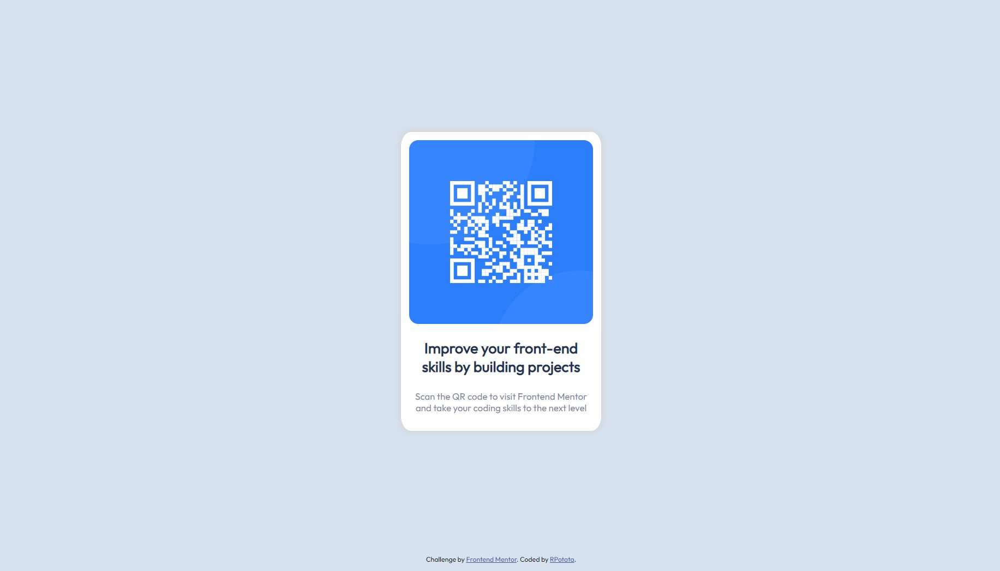

# Frontend Mentor - QR code component solution

This is a solution to the [QR code component challenge on Frontend Mentor](https://www.frontendmentor.io/challenges/qr-code-component-iux_sIO_H). Frontend Mentor challenges help you improve your coding skills by building realistic projects.

## Table of contents

- [Overview](#overview)
  - [Screenshot](#screenshot)
- [My process](#my-process)
  - [Built with](#built-with)
  - [What I learned](#what-i-learned)
  - [Useful resources](#useful-resources)
- [Author](#author)

## Overview

### Screenshot



## My process

### Built with

- Semantic HTML5 markup
- CSS custom properties
- Flexbox

### What I learned

Using variables in css for colors is cool and easy

```css
:root {
  --white: hsl(0, 0%, 100%);
  --lightGray: hsl(212, 45%, 89%);
  --grayishBlue: hsl(220, 15%, 55%);
  --darkBlue: hsl(218, 44%, 22%);
}
```

You can drop shadows on objects quite easily
```css
.container {
    /*x offset, y offset, blur size, spread, color*/
    box-shadow: 0 0 10px 2px lightgray;
}
```
### Useful resources

- [Variables](https://www.w3schools.com/css/css3_variables.asp) - This helped me with understanding css variables
- [Shadow](https://developer.mozilla.org/en-US/docs/Web/CSS/box-shadow) - Documentation that I found regarding the shadows

## Author

- Github - [Rosalko](https://github.com/Rosalko)
- Frontend Mentor - [@Rosako](https://www.frontendmentor.io/profile/Rosalko)
- Linkedin - [@Robert Zvara](https://www.linkedin.com/in/robert-zvara-bb5a04234/)
